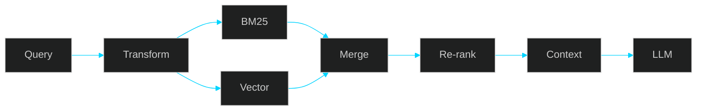
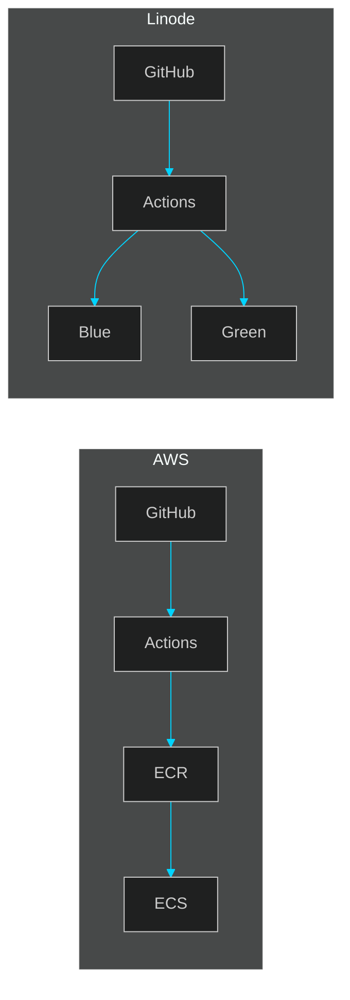

```
┌──────────────────────────────────────────────────────────────────────────────┐
│  ●  ●  ●   rishi@github:~/profile                                            │
└──────────────────────────────────────────────────────────────────────────────┘
```

<div align="center">
  
[](https://git.io/typing-svg)

[](https://linkedin.com/in/)
[](https://huggingface.co/Rishi-19)
[](mailto:sangarerishi@gmail.com)

</div>

---

### `rishi@github:~$` whoami

```yaml
Name:      Rishi Sangare
Role:      Backend & LLM Systems Engineer
Location:  Mumbai, India
Education: MBATech (CS + Finance) @ NMIMS | 2021-2026

Focus:
  - Production LLM Systems
  - Search Infrastructure (Elasticsearch, OpenSearch)
  - Cloud Architecture (AWS, Linode)
  - API Pipeline Design

Philosophy: "Treat LLMs as unreliable. Add guardrails. Validate everything."
```

---

### `rishi@github:~$` cat tech_stack.json

```json
{
  "languages": ["Python", "Java", "JavaScript", "SQL", "C++"],
  "backend": ["FastAPI", "Flask", "REST APIs", "Async Pipelines"],
  "cloud": ["AWS ECS", "ECR", "Lambda", "API Gateway", "CDK", "Docker", "Linode"],
  "search": ["Elasticsearch", "OpenSearch", "Hybrid RAG", "BM25 + Vector"],
  "ai_ml": ["LLM APIs", "OpenAI", "Claude", "Fine-tuning", "Transformers"],
  "devops": ["GitHub Actions", "Blue-Green Deployment", "CloudWatch", "CI/CD"],
  "tools": ["Postman", "APIDog", "Notion", "Slack", "Git"]
}
```

---

### `rishi@github:~$` ls projects/

```
drwxr-xr-x  recruiter-copilot/
drwxr-xr-x  hybrid-rag/
drwxr-xr-x  cloud-infra/
drwxr-xr-x  chrome-extension/
drwxr-xr-x  llm-from-scratch/
```

---

#### `recruiter-copilot/` — LLM + Search Pipeline

Production system evaluating candidates against job descriptions using search + LLM reasoning.


| Metric | Value |
|--------|-------|
| Latency Reduction | `2.5 min → 40 sec` |
| Tokens per Batch | `~80,000` |
| Candidates Evaluated | `~40 per request` |

---

#### `hybrid-rag/` — Retrieval Augmented Generation

Full RAG system combining lexical (BM25) and semantic (vector) retrieval.



| Design Constraint | Status |
|-------------------|--------|
| Deterministic Retrieval | ✓ |
| Bounded Context | ✓ |
| Testable Outputs | ✓ |
| Anti-Hallucination | ✓ |

---

#### `cloud-infra/` — AWS + Linode CI/CD

Designed deployment architecture across managed (AWS) and self-hosted (Linode) environments.



| Feature | Implementation |
|---------|---------------|
| AWS | ECS + ECR + CDK (IaC) |
| Linode | Blue-Green + Health Checks |
| Rollback | Automatic on failure |

---

#### `chrome-extension/` — LinkedIn Data Pipeline

Recruiter-facing tool for structured LinkedIn profile extraction.


| Metric | Value |
|--------|-------|
| Daily API Hits | `~70-80` |
| Active Users | Recruiters @ Sachi (Japan) |
| Uptime | `99.9%` |

---

#### `llm-from-scratch/` — Transformer Implementation

Built a language model following *Attention Is All You Need*.

```
Components Built:
├── Multi-Head Self-Attention
├── Positional Embeddings  
├── Feed-Forward Networks
├── Training Loop
└── Streamlit Visualization UI

Outcome: Deep understanding of why LLM failures are system-level, not model-level.
```

---

### `rishi@github:~$` git log --oneline experience

```
Feb 2025  LD Technologies ──────────── Backend & LLM Systems Engineer
          │ FastAPI, AWS CDK, OpenSearch, LLM Pipelines
          │ Chrome Extension, CI/CD, Production Systems

Jul 2024  Splan Infocom ────────────── Backend API Developer
          │ Invoice Processing API, OpenAI, AWS EC2

Jun 2024  Paragon Dynamics ─────────── Backend Intern
          │ Logistics Chatbot, Ledger Reconciliation

Dec 2023  Mitwa.ai ─────────────────── Founding Engineer
          │ MERN Stack, LLM Fine-tuning (Mistral-7B), RunPod
```

---

### `rishi@github:~$` cat education.txt

```
NMIMS Mumbai
├── Degree: MBATech (Computer Engineering + Finance)
├── Duration: 2021 - 2026
├── GPA: 3.09 / 4.00
└── Coursework: DSA, ML, AI, DBMS, Financial Planning, Tech Management

Certifications:
├── Generative AI with LLMs — DeepLearning.AI & AWS
└── Advanced Data Science & AI — IIT Madras
```

---

### `rishi@github:~$` cat README.txt

```
Note on Repositories:
├── Some repos contain architecture documentation only
├── Client source code not shared (IP policies)
└── System designs and decisions are real + production-tested

Happy to discuss tradeoffs and implementation details.
```

---

```
┌──────────────────────────────────────────────────────────────────────────────┐
│  rishi@github:~/profile$ exit                                                │
│  Connection closed.                                                          │
└──────────────────────────────────────────────────────────────────────────────┘
```
