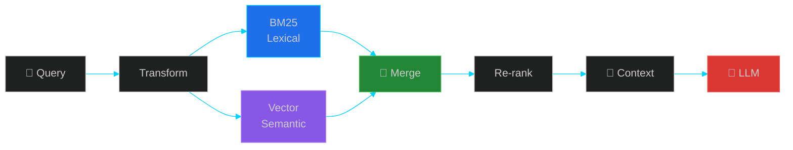
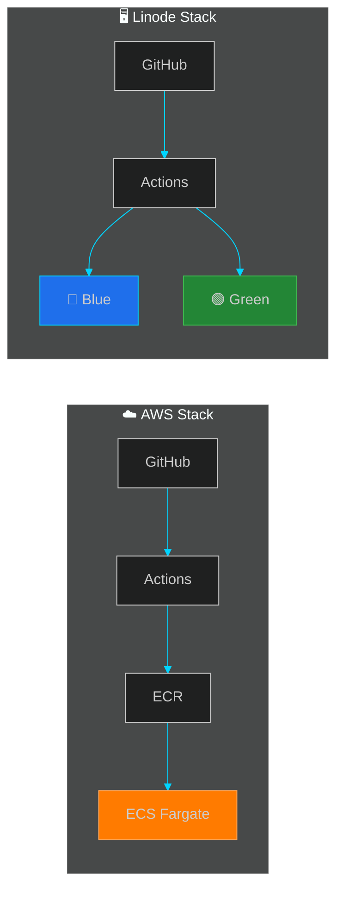
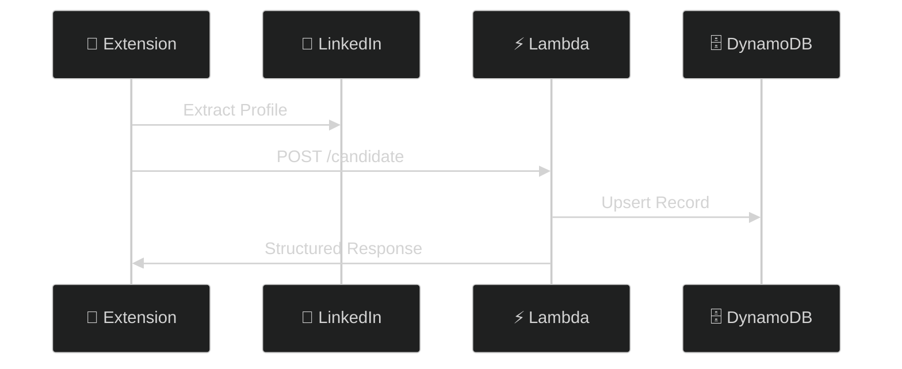

<div align="center">

<!-- Terminal Window Header -->


<table>
<tr>
<td width="100%" align="left" style="border: none;">

```
┌─────────────────────────────────────────────────────────────────────────────────────────────┐
│  🔴 🟡 🟢   rishi@github:~/profile                                                    ─ □ x  │
├─────────────────────────────────────────────────────────────────────────────────────────────┤
```

</td>
</tr>
</table>

<!-- Animated Typing with Cursor -->
<a href="https://github.com/rishi-sangare">
  
</a>

<br/>

<a href="https://github.com/rishi-sangare">
  
</a>

<br/><br/>

<!-- Social Badges -->
[](https://linkedin.com/in/)
[](https://huggingface.co/Rishi-19)
[](mailto:sangarerishi@gmail.com)
[](https://github.com/)

</div>

---


```yaml
┌─────────────────────────────────────────────────────────────────────────────┐
│                                                                             │
│   Name           Rishi Sangare                                              │
│   Role           Backend & LLM Systems Engineer                             │
│   Location       Mumbai, India                                              │
│   Education      MBATech (CS + Finance) @ NMIMS | 2021-2026                │
│                                                                             │
│   Focus          ▸ Production LLM Systems                                   │
│                  ▸ Search Infrastructure                                    │
│                  ▸ Cloud Architecture                                       │
│                  ▸ API Pipeline Design                                      │
│                                                                             │
│   Philosophy     "Treat LLMs as unreliable. Add guardrails. Validate."     │
│                                                                             │
└─────────────────────────────────────────────────────────────────────────────┘
```

---


```json
{
  "languages": {
    "primary": ["Python", "SQL"],
    "secondary": ["Java", "JavaScript", "C++"]
  },
  "backend": {
    "frameworks": ["FastAPI", "Flask"],
    "patterns": ["REST APIs", "Async Pipelines", "Event-Driven"]
  },
  "cloud": {
    "aws": ["ECS", "ECR", "Lambda", "API Gateway", "CDK", "CloudWatch"],
    "containers": ["Docker", "Docker Compose"],
    "other": ["Linode", "RunPod"]
  },
  "search": {
    "engines": ["Elasticsearch", "OpenSearch"],
    "techniques": ["Hybrid RAG", "BM25", "Vector Search", "Re-ranking"]
  },
  "ai_ml": {
    "apis": ["OpenAI", "Claude", "Gemini"],
    "local": ["Fine-tuning", "Transformers", "Mistral-7B"]
  },
  "devops": {
    "ci_cd": ["GitHub Actions", "Blue-Green Deployment"],
    "monitoring": ["CloudWatch", "Slack Alerts", "Dozzle"]
  }
}
```

---


```
total 5
drwxr-xr-x   recruiter-copilot    4.0K   production   LLM + Search Pipeline
drwxr-xr-x   hybrid-rag           3.2K   production   RAG Architecture
drwxr-xr-x   cloud-infra          2.8K   production   AWS + Linode CI/CD
drwxr-xr-x   chrome-extension     2.1K   production   LinkedIn Data Pipeline
drwxr-xr-x   llm-from-scratch     1.5K   learning     Transformer Implementation
```

---


**Production LLM + Search Pipeline** — Evaluates 40+ candidates per job description

```mermaid
%%{init: {'theme': 'dark', 'themeVariables': { 'primaryColor': '#00d4ff', 'edgeLabelBackground':'#0d1117', 'tertiaryColor': '#161b22', 'lineColor': '#3fb950', 'textColor': '#c9d1d9'}}}%%
flowchart LR
    A[📄 Job Description] --> B[🔍 Feature Extraction]
    B --> C[⚡ Query Generation]
    C --> D[(OpenSearch)]
    D --> E[👥 Candidate Pool]
    E --> F[🤖 LLM Evaluation]
    F --> G[📊 Ranked Results]
    
    style A fill:#1f6feb,stroke:#00d4ff
    style D fill:#238636,stroke:#3fb950
    style F fill:#8957e5,stroke:#bc8cff
    style G fill:#da3633,stroke:#f85149
```



| Metric | Before | After |
|:-------|:------:|:-----:|
| **Latency** | `2.5 min` | `40 sec` |
| **Tokens/Batch** | — | `~80,000` |
| **Candidates** | — | `~40/request` |

---


**Retrieval Augmented Generation** — BM25 + Vector dual retrieval



```
✓ Deterministic Retrieval    ✓ Bounded Context    ✓ Testable    ✓ Anti-Hallucination
```

---


**AWS + Linode Deployment** — Blue-Green CI/CD with zero downtime



| Environment | Stack |
|:------------|:------|
| **AWS** | ECS + ECR + CDK + API Gateway |
| **Linode** | Blue-Green + Health Checks + Rollback |

---


**LinkedIn Data Pipeline** — Production tool for recruiters



| Production Stats | |
|:-----------------|:--|
| Daily API Hits | `~70-80` |
| Active Users | Sachi (Japan) |
| Uptime | `99.9%` |

---


**Transformer Implementation** — Following *Attention Is All You Need*

```
┌─────────────────────────────────────────────────────────────┐
│                    TRANSFORMER BLOCK                        │
│  ┌───────────────────────────────────────────────────────┐  │
│  │              Multi-Head Self-Attention                │  │
│  │         Q ──┐                                         │  │
│  │         K ──┼──► Scaled Dot-Product ──► Concat        │  │
│  │         V ──┘                                         │  │
│  └───────────────────────────────────────────────────────┘  │
│                           │                                 │
│                      Add & Norm                             │
│                           │                                 │
│  ┌───────────────────────────────────────────────────────┐  │
│  │               Feed Forward Network                    │  │
│  └───────────────────────────────────────────────────────┘  │
│                           │                                 │
│                      Add & Norm                             │
└─────────────────────────────────────────────────────────────┘

Outcome: Understanding why LLM failures are system-level, not model-level.
```

---


```diff
+ Feb 2025   LD Technologies ─────────────── Backend & LLM Systems Engineer
             │ FastAPI • AWS CDK • OpenSearch • LLM Pipelines • Chrome Extension

  Jul 2024   Splan Infocom ──────────────── Backend API Developer
             │ Invoice Processing • OpenAI API • AWS EC2

  Jun 2024   Paragon Dynamics ───────────── Backend Intern
             │ Logistics Chatbot • Ledger Reconciliation

  Dec 2023   Mitwa.ai ───────────────────── Founding Engineer
             │ MERN Stack • LLM Fine-tuning (Mistral-7B) • RunPod
```

---


```
╔═══════════════════════════════════════════════════════════════════════════╗
║  NMIMS Mumbai                                                             ║
║  ├── Degree     MBATech (Computer Engineering + Finance)                  ║
║  ├── Duration   2021 - 2026                                               ║
║  ├── GPA        3.09 / 4.00                                               ║
║  └── Courses    DSA • ML • AI • DBMS • Financial Planning • Tech Mgmt    ║
╠═══════════════════════════════════════════════════════════════════════════╣
║  Certifications                                                           ║
║  ├── Generative AI with LLMs ──────── DeepLearning.AI & AWS              ║
║  └── Advanced Data Science & AI ───── IIT Madras                         ║
╚═══════════════════════════════════════════════════════════════════════════╝
```

---

<div align="center">


<br/><br/>

<!-- GitHub Stats with Private Contributions -->
<picture>
  <source media="(prefers-color-scheme: dark)" srcset="https://github-readme-stats.vercel.app/api?username=rishi-sangare&show_icons=true&count_private=true&include_all_commits=true&theme=github_dark&hide_border=true&bg_color=0d1117&title_color=00d4ff&icon_color=3fb950&text_color=c9d1d9"/>
  
</picture>
<picture>
  <source media="(prefers-color-scheme: dark)" srcset="https://streak-stats.demolab.com?user=rishi-sangare&theme=github-dark-blue&hide_border=true&background=0D1117&ring=00D4FF&fire=3FB950&currStreakLabel=00D4FF"/>
  
</picture>

<br/><br/>

<!-- Activity Graph -->


</div>

---


```
┌─────────────────────────────────────────────────────────────────────────────┐
│  Some repositories contain architecture documentation only.                │
│  Client source code not shared due to IP policies.                         │
│  System designs and decisions are real + production-tested.                │
│                                                                             │
│  Happy to discuss tradeoffs and implementation details.                    │
└─────────────────────────────────────────────────────────────────────────────┘
```

---

<div align="center">

<a href="https://github.com/rishi-sangare">
  
</a>

<br/><br/>

```
└──────────────────────────────────────────────────────────────────────────────────────────────┘
```

</div>
