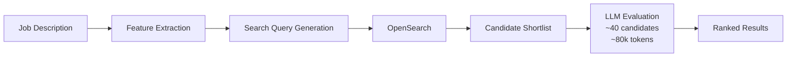
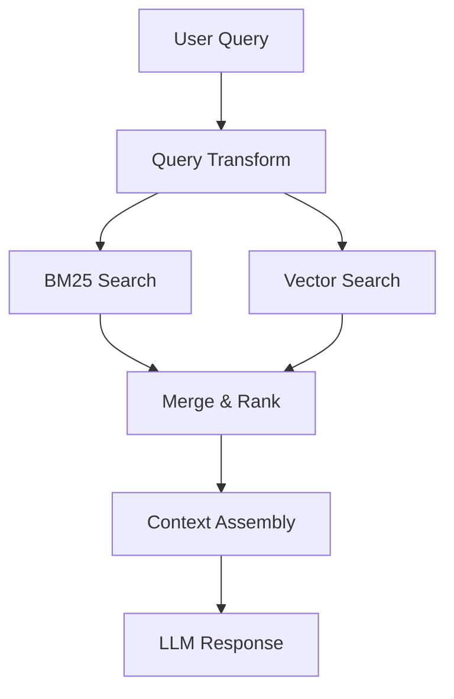
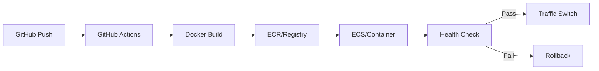

# Rishi Sangare

**Backend & LLM Systems Engineer**

[](https://linkedin.com/in/)
[](https://huggingface.co/Rishi-19)
[](mailto:sangarerishi@gmail.com)

---

## What I Do

I build **production-grade backend systems** with a focus on LLM integration, search infrastructure, and cloud deployment. I specialize in taking complex, ambiguous requirements and turning them into structured, reliable, and testable systems.

```
LLM APIs → Structured Pipelines → Validated Outputs → Production Deployment
```

---

## Technical Stack

| Domain | Technologies |
|--------|-------------|
| **Backend** | Python, FastAPI, Flask, REST APIs |
| **Cloud** | AWS (ECS, ECR, Lambda, API Gateway, CDK), Linode, Docker |
| **Search** | Elasticsearch, OpenSearch, Hybrid Search (BM25 + Vector) |
| **AI/ML** | LLM APIs (OpenAI, Claude), RAG Systems, Model Fine-tuning |
| **DevOps** | GitHub Actions, Blue-Green Deployment, CloudWatch |

---

## Systems I've Built

### 1. Recruiter Copilot — LLM + Search Pipeline

Production system that evaluates candidates against job descriptions using search + LLM reasoning.



**Key Engineering:**
- Reduced latency from **~2.5 min → ~40 sec**
- Batched LLM calls with rate-limit-safe execution
- Built custom testing framework with golden datasets

---

### 2. Hybrid RAG Architecture

Full retrieval-augmented generation system combining lexical and semantic search.



**Focus:** Deterministic behavior, controlled context size, testable retrieval outputs.

---

### 3. Cloud Deployment Architecture

Designed and operated deployment pipelines across AWS and self-managed infrastructure.



**Implementations:**
- **AWS:** ECS + ECR + CDK for infrastructure-as-code
- **Linode:** Blue-green deployment, SSL, log rotation, near-zero downtime

---

### 4. Chrome Extension — LinkedIn Data Pipeline

Recruiter-facing tool for structured LinkedIn profile extraction.


**Production usage:** ~70-80 API hits/day by recruiters.

---

### 5. LLM From Scratch

Transformer-based language model following *Attention Is All You Need*.

Built: Attention mechanism, embeddings, training loop, Streamlit UI for visualization.

**Outcome:** Deep intuition into why LLMs behave unpredictably and why most failures are system-level.

---

## Design Philosophy

```
┌─────────────────────────────────────────────────────────────┐
│  Design execution flows before writing code                 │
│  Treat LLMs as unreliable components → add guardrails       │
│  Validate outputs continuously, not just inputs             │
│  Optimize for predictability before scale                   │
└─────────────────────────────────────────────────────────────┘
```

---

## Education & Certifications

**NMIMS** — MBATech (Computer Engineering + Finance) | 2021–2026

Coursework: DSA, ML, AI, DBMS, Software Engineering, Financial Planning, Tech Management

**Certifications:**
- Generative AI with LLMs — DeepLearning.AI & AWS
- Advanced Data Science & AI — IIT Madras

---

## Note on Repositories

Some repositories contain architecture documentation only. Source code from client work is not shared due to IP policies, but system designs and implementation decisions are real and production-tested.

---

*Open to discussing LLM systems, backend architecture, and deployment patterns.*
