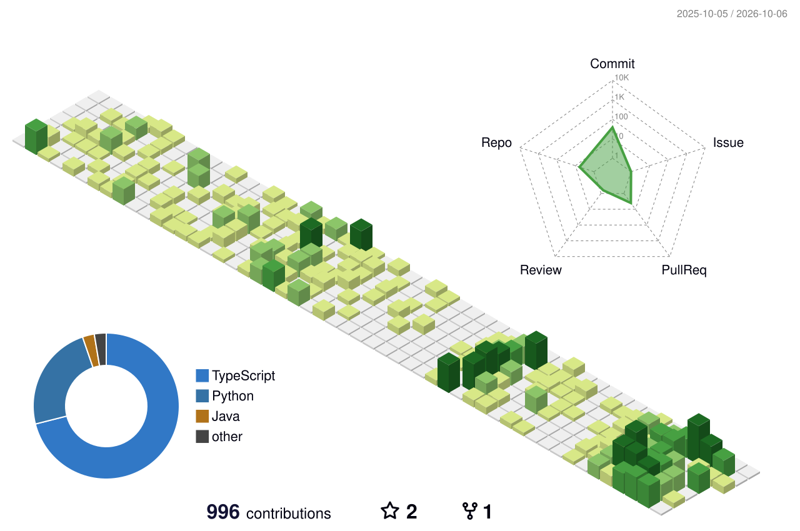

<picture>
  <source media="(prefers-color-scheme: dark)" srcset="assets/hero-dark.svg">
  
</picture>

  
  
  
  

<picture>
  <source media="(prefers-color-scheme: dark)" srcset="assets/stats-dark.svg">
  
</picture>

### What I do

I build **production LLM systems end to end** at [LD Technologies](https://github.com/Saachi-AI) (since Feb 2025): retrieval, orchestration, evals, security and the infra that keeps them up. My clients include a large Japanese recruiting database platform and a UK recruitment CRM, and I ship our own SaaS products.

- **LLM products, not demos.** Multi-turn LLM flows, multi-provider fallbacks, structured output that survives bad model responses.
- **Search and evals.** Elasticsearch relevance, golden sets, recall@k, LLM-as-judge, bias probes. I measure before I claim.
- **Ownership.** CI/CD with rollback, Slack alerting, security hardening, and incident response when things break.
- **AI-native speed.** I run coding agents (Claude Code, MCP, browser automation) as a daily force multiplier, with guardrails.

 

<picture>
  <source media="(prefers-color-scheme: dark)" srcset="assets/pipeline-dark.svg">
  
</picture>

### Featured work

<table>
<tr>
<td width="50%"><a href="https://github.com/rishi-sangare/case-studies/blob/main/refinecv.md"><picture><source media="(prefers-color-scheme: dark)" srcset="assets/card-refinecv-dark.svg"></picture></a></td>
<td width="50%"><a href="https://github.com/rishi-sangare/case-studies/blob/main/recruiter-copilot.md"><picture><source media="(prefers-color-scheme: dark)" srcset="assets/card-copilot-dark.svg"></picture></a></td>
</tr>
<tr>
<td width="50%"><a href="https://github.com/rishi-sangare/case-studies/blob/main/crm-migration.md"><picture><source media="(prefers-color-scheme: dark)" srcset="assets/card-migration-dark.svg"></picture></a></td>
<td width="50%"><a href="https://github.com/rishi-sangare/cosmeon-fs-lite"><picture><source media="(prefers-color-scheme: dark)" srcset="assets/card-cosmeon-dark.svg"></picture></a></td>
</tr>
</table>

Most of my work is in private client repos. The <a href="https://github.com/rishi-sangare/case-studies">case studies</a> explain the architecture, the decisions and the measured results, without client code.

### Open source

- **keras-team/keras** · [#22407](https://github.com/keras-team/keras/pull/22407) (merged): implemented `numpy.view` for the OpenVINO backend.
- **Hugging Face** · [Rishi-19](https://huggingface.co/Rishi-19): Mistral-7B fine-tunes (including DPO on 6k and 18k-example datasets) for an AI wellbeing companion, plus a DistilBERT profanity classifier.
- **Smart India Hackathon** 2024 and 2025: sign-language detection; a document-processing platform for Kochi Metro (FastAPI, MinIO, Postgres, Gemini).

### Toolbox

  

Also: Cerebras · OpenRouter · Bedrock · Claude · OpenAI · Gemini · MCP · n8n · Playwright · pytest · Vitest · WeasyPrint · Chrome MV3 · MLX

### Contribution graph, in 3D

<picture>
  <source media="(prefers-color-scheme: dark)" srcset="profile-3d-contrib/profile-night-rainbow.svg">
  
</picture>

<b>More projects</b>

 

| Project | What it is | Stack |
|---|---|---|
| Tamago AI services | LLM candidate ↔ job matching for a Japanese recruiting database: 3-turn pre-screening, ES retrieval, eval harness | FastAPI · Elasticsearch · Cerebras · Supabase |
| Hybrid search ingestion | BM25 + vector search over job descriptions on AWS OpenSearch, switchable LLM extraction | FastAPI · OpenSearch · AWS CDK |
| LinkedIn → ATS extension | Recruiter tool syncing LinkedIn profiles into a client ATS | Chrome · Lambda · DynamoDB |
| Revenue Rail | Self-hosted n8n replacing Zapier: Stripe → Thinkific → Slack, duplicate-safe, 11/11 failure scenarios pass | n8n · Postgres · Docker |
| Signal Lab | Privacy-first Meta Conversions API relay with Apple AdAttributionKit JWS verification | Next.js · TypeScript |
| AI Video Studio | Agent-operated video pipeline with on-device ASR/TTS and automated QA gates | Python · MLX · Remotion |
| Consistency Check | Does an LLM answer the same in English, Hindi and Hinglish? | FastAPI · Ollama · Claude |
| [My_LLM](https://github.com/rishi-sangare/My_LLM) | A transformer from scratch | Python |

<b>How I work</b>

 

1. **Plan in public.** A short design doc or diagram before code, and plain-English explainers for non-engineers.
2. **Measure, then claim.** Golden sets and holdouts. When I caught my own +30% reranker result inflated, I reported the honest +12.9%.
3. **Guardrails on everything.** Staging-first releases, idempotent writes, LLM output validation, spend caps.
4. **Treat LLMs as unreliable components.** Validate, fall back, alert.

 <b>Open to full-time remote roles</b> · AI / LLM engineering · search & relevance · applied AI Based in Mumbai (IST) · comfortable working US hours · <a href="mailto:sangarerishi@gmail.com">sangarerishi@gmail.com</a>

